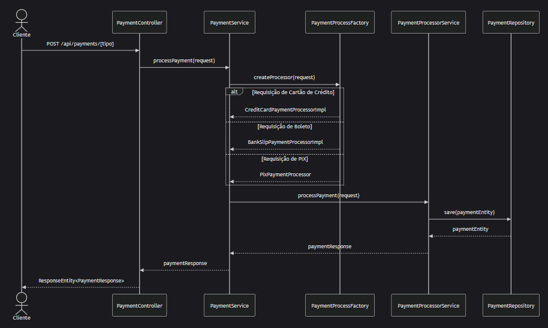

# API de Processamento de Pagamentos

## Índice

- [Sobre o Projeto](#sobre-o-projeto)
- [Tecnologias Utilizadas](#tecnologias-utilizadas)
- [Estrutura do Projeto](#estrutura-do-projeto)
- [Padrão Factory Method](#padrão-factory-method)
  - [Implementação no Projeto](#implementação-no-projeto)
  - [Diagrama de Sequência](#diagrama-de-sequência)
- [Enumerações](#enumerações)
  - [Métodos de Pagamento](#métodos-de-pagamento-paymentmethod)
  - [Status de Pagamento](#status-de-pagamento-paymentstatus)
- [Endpoints da API](#endpoints-da-api)
  - [Pagamento com Cartão de Crédito](#pagamento-com-cartão-de-crédito)
  - [Pagamento com Boleto Bancário](#pagamento-com-boleto-bancário)
  - [Pagamento com PIX](#pagamento-com-pix)
- [Como Executar o Projeto](#como-executar-o-projeto)
  - [Acessando o Banco de Dados H2](#acessando-o-banco-de-dados-h2)
- [Documentação da API](#documentação-da-api)
- [Testes](#testes)
- [Princípios SOLID Aplicados](#princípios-solid-aplicados)
- [Contribuição](#contribuição)
- [Licença](#licença)
- [Contato](#contato)

## Sobre o Projeto

Esta API de processamento de pagamentos foi desenvolvida para lidar com diferentes métodos de pagamento utilizando o padrão de design Factory Method. A aplicação suporta pagamentos via cartão de crédito, boleto bancário e PIX, seguindo os princípios de SOLID para garantir um código limpo, extensível e de fácil manutenção.

## Tecnologias Utilizadas

- Java 17
- Spring Boot
- Spring MVC
- Spring Data JPA
- H2 Database (banco de dados em memória)
- Lombok
- Jakarta Persistence API
- Swagger/OpenAPI (documentação da API)
- JUnit 5 (para testes)

## Estrutura do Projeto

O projeto segue uma arquitetura em camadas bem definida:

```
├── config             # Configurações gerais (Segurança, Swagger, CORS, Beans)
├── controller         # REST Controllers (endpoints)
├── response           # Data Transfer Objects (resposta)
├── request            # Data Transfer Objects (requisição)
├── exception          # Tratamento de erros e exceções customizadas
├── mapper             # MapStruct ou mapeadores manuais DTO ↔ Entity
├── model              # Entidades JPA / domain objects
├── repository         # Spring Data JPA Repositories
├── service            # Regras de negócio (interfaces)
├── service.impl       # Implementações de Service
└── util               # Classes utilitárias e helpers
```


## Padrão Factory Method

Este projeto implementa o padrão de design Factory Method para lidar com diferentes tipos de processadores de pagamento. O Factory Method é um padrão criacional que:

- Fornece uma interface para criar objetos em uma superclasse, mas permite que as subclasses alterem o tipo de objetos criados
- Promove baixo acoplamento entre classes
- Segue o princípio Open/Closed do SOLID, permitindo adicionar novos tipos de pagamento sem modificar o código existente

### Implementação no Projeto

A implementação do Factory Method neste projeto consiste em:

1. **Interface do Produto**: `PaymentProcessorService` - Define o contrato para todos os processadores de pagamento
2. **Produtos Concretos**: 
   - `CreditCardPaymentProcessorImpl` - Processa pagamentos com cartão de crédito
   - `BankSlipPaymentProcessorImpl` - Processa pagamentos com boleto bancário
   - `PixPaymentProcessor` - Processa pagamentos via PIX

3. **Fábrica**: `PaymentProcessFactory` - Responsável por criar o processador apropriado com base no tipo de requisição

4. **Cliente**: `PaymentService` - Utiliza a fábrica para obter o processador correto sem conhecer as implementações concretas

O fluxo de funcionamento é:

1. O `PaymentController` recebe uma requisição de pagamento
2. O controller chama o `PaymentService.processPayment()`
3. O service utiliza o `PaymentProcessFactory` para obter o processador adequado
4. O factory identifica o tipo de requisição e retorna o processador correspondente
5. O service utiliza o processador para processar o pagamento
6. O resultado é retornado ao controller e então ao cliente

Esta abordagem permite adicionar novos métodos de pagamento facilmente, bastando:
1. Criar uma nova classe de requisição que estenda `PaymentRequest`
2. Implementar um novo processador que implemente `PaymentProcessorService`
3. Registrar o novo processador no `PaymentProcessFactory`

Sem necessidade de modificar o código existente, seguindo o princípio Open/Closed.

### Diagrama de Sequência

O diagrama abaixo ilustra o fluxo de processamento de um pagamento:


O diagrama de sequência acima ilustra:

1. O cliente faz uma requisição HTTP POST para um dos endpoints de pagamento
2. O controlador recebe a requisição e chama o serviço de pagamento
3. O serviço utiliza a fábrica para obter o processador adequado com base no tipo de requisição
4. A fábrica retorna o processador específico para o tipo de pagamento
5. O serviço utiliza o processador para processar o pagamento
6. O processador salva os dados do pagamento no repositório
7. O processador retorna a resposta do pagamento
8. A resposta é retornada ao cliente

Este fluxo demonstra claramente o padrão Factory Method em ação, onde o tipo concreto do processador é determinado em tempo de execução com base no tipo de requisição.

## Enumerações

### Métodos de Pagamento (PaymentMethod)

O sistema suporta os seguintes métodos de pagamento:

- `CREDIT_CARD`: Pagamento com cartão de crédito
- `BANK_SLIP`: Pagamento com boleto bancário
- `PIX`: Pagamento via PIX (sistema de pagamento instantâneo brasileiro)

### Status de Pagamento (PaymentStatus)

Os pagamentos podem ter os seguintes status:

- `PENDING`: Pagamento pendente de processamento
- `PROCESSING`: Pagamento em processamento
- `COMPLETED`: Pagamento concluído com sucesso
- `FAILED`: Falha no processamento do pagamento
- `REFUNDED`: Pagamento estornado

## Endpoints da API

### Pagamento com Cartão de Crédito
```
POST /api/payments/credit-card
```

**Exemplo de Requisição:**
```json
{
  "amount": 100.50,
  "cardNumber": "4111111111111111",
  "cardHolderName": "John Doe",
  "expirationDate": "12/25",
  "cvv": "123"
}
```

**Exemplo de Resposta:**
```json
{
  "id": 123456,
  "amount": 100.50,
  "paymentMethod": "CREDIT_CARD",
  "transactionId": "tx_123456789",
  "createdAt": "2023-06-15T14:30:00",
  "status": "COMPLETED",
  "receiptUrl": "https://example.com/receipts/123456"
}
```

### Pagamento com Boleto Bancário
```
POST /api/payments/bank-slip
```

**Exemplo de Requisição:**
```json
{
  "amount": 250.75,
  "customerName": "Maria Silva",
  "customerDocument": "123.456.789-00",
  "customerAddress": "Rua Exemplo, 123 - São Paulo, SP"
}
```

**Exemplo de Resposta:**
```json
{
  "id": 123457,
  "amount": 250.75,
  "paymentMethod": "BANK_SLIP",
  "transactionId": "tx_987654321",
  "createdAt": "2023-06-15T15:45:00",
  "status": "PENDING",
  "receiptUrl": "https://example.com/boletos/123457",
  "barCode": "23790.12345 67890.123456 78901.234567 8 12345678901234"
}
```

### Pagamento com PIX
```
POST /api/payments/pix
```

**Exemplo de Requisição:**
```json
{
  "amount": 75.30,
  "customerName": "Carlos Oliveira",
  "customerDocument": "987.654.321-00",
  "pixKey": "email@exemplo.com",
  "pixKeyType": "EMAIL"
}
```

**Exemplo de Resposta:**
```json
{
  "id": 123458,
  "amount": 75.30,
  "paymentMethod": "PIX",
  "transactionId": "tx_456789123",
  "createdAt": "2023-06-15T16:20:00",
  "status": "COMPLETED",
  "receiptUrl": "https://example.com/pix/123458",
  "pixCopyPaste": "00020126580014br.gov.bcb.pix0136email@exemplo.com5204000053039865802BR5913Carlos Oliveira6009Sao Paulo62070503***63041234"
}
```


## Como Executar o Projeto

1. Certifique-se de ter o JDK 17 instalado
2. Clone o repositório
3. O projeto já está configurado para usar o banco de dados H2 em memória
4. Execute o comando: `./mvnw spring-boot:run`
5. A API estará disponível em: `http://localhost:8080`

### Acessando o Banco de Dados H2

O console do H2 está habilitado e pode ser acessado em:
```
http://localhost:8080/h2-console
```

Credenciais de acesso (conforme definido em application.properties):
- JDBC URL: `jdbc:h2:mem:testdb`
- Username: `sa`
- Password: `password`

## Documentação da API

A documentação completa da API está disponível via Swagger UI em:
```
http://localhost:8080/swagger-ui.html
```

A documentação OpenAPI também pode ser acessada em formato JSON:
```
http://localhost:8080/api-docs
```


## Testes

Para executar os testes:
```
./mvnw test
```


## Princípios SOLID Aplicados

### Single Responsibility Principle (SRP)
Cada processador de pagamento tem uma única responsabilidade de processar um tipo específico de pagamento.

### Open/Closed Principle (OCP)
A estrutura permite adicionar novos tipos de pagamento sem modificar o código existente, apenas criando novos processadores que implementem a interface PaymentProcessorService.

### Liskov Substitution Principle (LSP)
Todos os processadores de pagamento podem ser usados de forma intercambiável através da interface PaymentProcessorService.

### Interface Segregation Principle (ISP)
A interface PaymentProcessorService é focada apenas no essencial para o processamento de pagamentos.

### Dependency Inversion Principle (DIP)
As classes de alto nível dependem de abstrações (interfaces) e não de implementações concretas.

## Contribuição

1. Faça um fork do projeto
2. Crie uma branch para sua feature (`git checkout -b feature/nova-feature`)
3. Faça commit das suas alterações (`git commit -m 'Adiciona nova feature'`)
4. Faça push para a branch (`git push origin feature/nova-feature`)
5. Abra um Pull Request
6. 
## Contato

Para mais informações, entre em contato através deste link: https://www.linkedin.com/in/heider1988/
